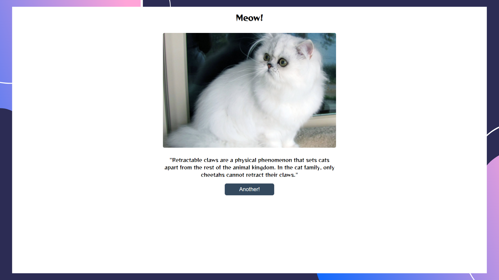

# Meow API
Project Idea from a list of [Free APIs](https://github.com/public-apis/public-apis) when I used both [Cats](https://docs.thecatapi.com/) and [Meow Facts](https://www.programmableweb.com/api/meow-facts)

Like [PurrFacts App](https://github.com/alanhcrdz/purrfacts), but this small aplication was built with React, and instead calling API data using fecth, this Application uses async function and axios, for get multiple data from different API calls.

## Features:
<ul>
    <li><a href="#preview">Preview</a></li>
    <li><a href="#effect">UseEffect Hook</a></li>
    <li><a href="#fetch">Calling API with fetch</a></li>
    
</ul>

</br>
</br>
<span id="preview">

## Design Preview:


<span id="effect">

## UseEffect
Performing a side effect in function components is a good idea, which is the case of fetching data.

<span id="fetch">

## Calling API with ```fetch```

I Used a function ```fecthData()``` in CatInfo component that gets data from 2 different APIs, using Promises and async/await. Then the [spread syntax](https://developer.mozilla.org/en-US/docs/Web/JavaScript/Reference/Operators/Spread_syntax) javascript method to handle with the data.


## Install
Install npm

```npm install```
</br>
</br>

Start project

```npm start```

